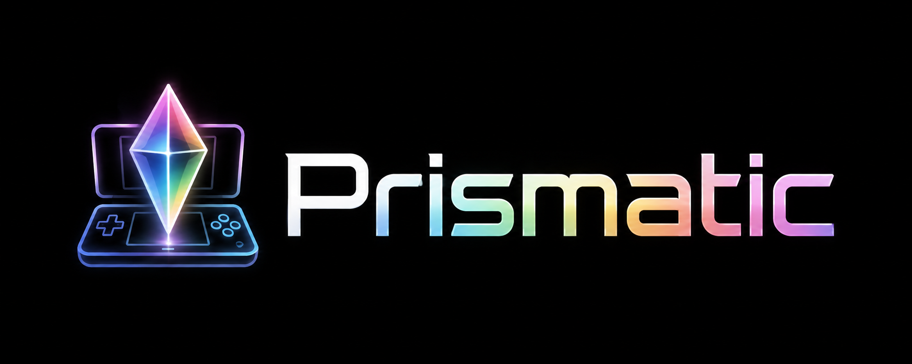
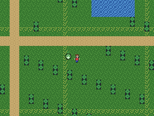
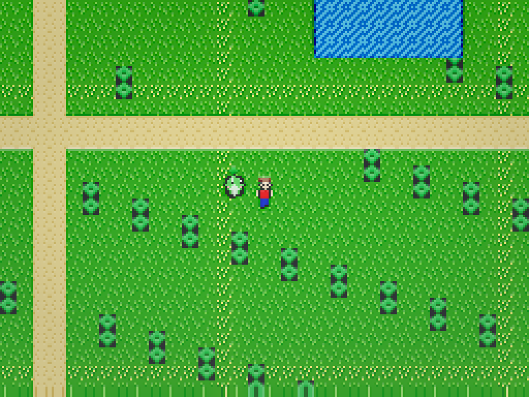
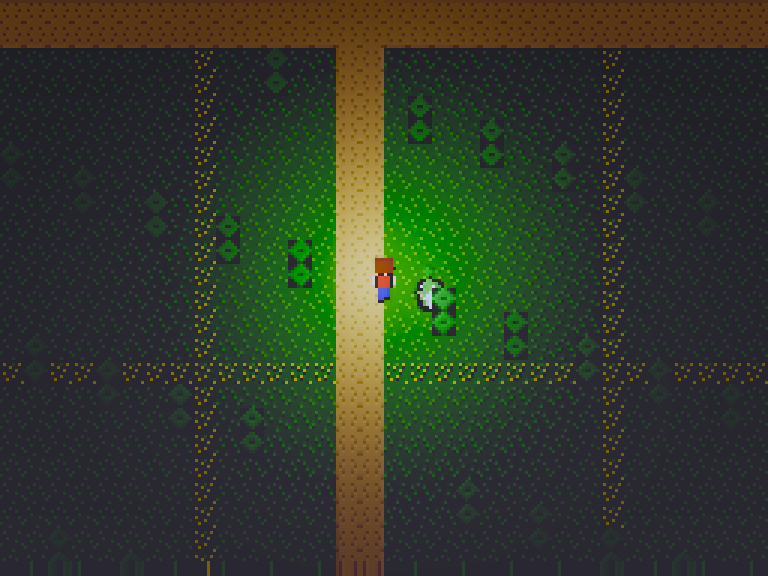
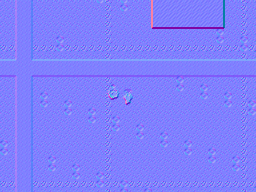

<!-- SPDX-License-Identifier: GPL-3.0-or-later -->
<div align="center">



### A game-aware launcher, emulator and mod platform for classic handhelds

Import your own **Game Boy · Game Boy Color · Game Boy Advance · Nintendo DS**
games, verify them, mod them safely and play them — clean ROMs are never
modified, and no game content is ever bundled or invented.

[](LICENSE)
[](core)
[](android)
[](shaders)
[](docs/TEST_REPORT.md)
[](docs/KNOWN_LIMITATIONS.md)

[**Getting started**](#-quick-start-desktop-core) ·
[**Android build**](docs/ANDROID_BUILD.md) ·
[**Architecture**](docs/ARCHITECTURE_DECISIONS.md) ·
[**Final report**](docs/FINAL_REPORT.md)

</div>

---

**PRISMATIC** is a game-focused platform for user-owned classic games: a clean
library and launcher, per-game management pages, hash-verified ROM import,
private mod installations (gen1recomp-style: clean ROM + selected mods → a
generated private build, launched automatically), per-game saves and save
states, camera and performance settings, and an accurate emulator underneath
(melonDS-backed for DS). First supported game family: **Pokémon HeartGold /
SoulSilver**, including the [Visual+ mod](https://github.com/DosukaSOL/pokemon-hgss-visual-mod)
as a one-tap install. Nothing is upscaled by an AI model and no artwork is ever
fabricated — every byte the player sees derives from their own ROM.

Game transformation/reconstruction experiments (2D→2.5D conversion) live in the
separate **[Foldscape](https://github.com/DosukaSOL/Foldscape)** project;
Prismatic can load Foldscape packages but does not implement them. A game-aware
shader/lighting engine is in development on a separate branch.

First hardware target: **AYN Thor Max** (Snapdragon 8 Gen 2, Adreno 740, dual
AMOLED, Android). First proof‑of‑concept: a DS‑shaped dual‑screen scene.

> [!IMPORTANT]
> This is an **in‑progress engineering project (pre‑alpha)**, not a finished
> product. It ships a genuinely working, tested enhancement **core** and an
> installable Android **APK**. A **real Nintendo DS backend (melonDS)** is now
> integrated end‑to‑end: it compiles, links, and **boots + runs** on the desktop
> host and inside the arm64 Android `.so` (verified with a first‑party test ROM).
> Booting a **commercial** ROM has **not** been verified on hardware yet — that
> gate is a device test the maintainer will run on the Thor. The GBA (mGBA)
> adapter is still designed, not implemented. See
> [What actually works](#-what-actually-works) and
> [Known limitations](docs/KNOWN_LIMITATIONS.md). No claim of "complete",
> "production ready", or "100% compatible" is made anywhere.

## 🆕 v0.4.0 — genuine depth 2.5D, a top‑screen‑only pipeline, and a games library

This release makes the 2.5D **real**, keeps the DS touch screen honest, and turns
the app into something you point at a folder and play from.

- **Genuine depth‑based 2.5D (DIBR).** When a game renders with the DS 3D engine
  (HGSS / SoulSilver / Platinum overworld), Prismatic now reads melonDS's real
  **per‑pixel depth buffer** and displaces pixels by true scene depth — actual
  parallax, not just a flat perspective tilt. Where there's no 3D depth it falls
  back to the honest geometric tilt.
- **Top‑screen only — the bottom screen stays faithful.** The shader grade, the
  2.5D depth and FXAA now apply to the **top screen only**. The DS **bottom
  screen** (menus, map, text, HUD) is presented untouched, so tweaking shaders no
  longer overexposes or smears the touch UI.
- **Transparent Shader Studio.** The editor is now a **translucent drawer** — you
  keep a live, unobstructed preview of the game while you tune every parameter.
- **Preset dropdown (your saved looks included).** Presets moved into a single
  **dropdown menu**; the moment you save a custom look it appears in that same
  list, prefixed ★, ready to re‑apply.
- **New reference‑grade presets.** Added **Octopath**, **Lumen**, and **Diorama** —
  the last tuned toward the warm, bright, miniature‑model "DramaticShape voxel
  mod" diorama look, and auto‑applied to HGSS / SoulSilver / Platinum on top of
  genuine depth.
- **Optional anti‑aliasing (FXAA).** A conservative, edge‑only FXAA pass you can
  toggle — on only when it helps, never softening the whole frame.
- **Full button mapping.** A **Button mapping** menu (open it with **Back**) lets
  you remap every AYN Thor button, set a dedicated **fast‑forward** key, and use
  L2/R2 (great for macros — the DS has no back buttons). Speed cycles **1x → 2x →
  5x**.
- **Games folder library.** Point Prismatic at a **folder of ROMs**; it scans
  every `.nds`, shows them in the menu, and labels each one **Compatible** or
  **Untested** by reading the cartridge code from the header.
- **Pokémon Platinum** joins the compatible list (USA/EUR/JPN) with the same
  genuine depth 2.5D + Diorama profile.

> Honesty note (2.5D): genuine depth only exists for **3D‑engine pixels**. 2D
> text, menus and HUD have no scene depth and ride the base plane; the bottom
> screen is deliberately left faithful. The **Diorama** preset is a real‑time
> DIBR + tilt‑shift + depth‑of‑field **analog** to DramaticShape's asset‑level
> voxel extrusion — not a literal voxel reconstruction (that needs a game's map
> data). Commercial‑ROM output on DS Pokémon has **not** been verified on
> hardware here; that remains a maintainer device test. Prismatic still ships
> **no ROMs** — bring your own dump.

## 🆕 v0.3.0 — Shader Studio, a real menu, and a compatibility list

This release turns the presentation layer into something you fully control, and
gives the app a proper front‑end.

- **Shader Studio (build your own look).** A live, on‑device editor — like the
  shader/【filter】panels on desktop melonDS — with **13 tweakable parameters**
  (brightness, exposure, contrast, saturation, temperature, tint, gamma,
  vignette, bloom + threshold, scanline, LCD grid, sharpen) plus the 2.5D depth
  tilt and lantern glow. Drag a slider and the game updates instantly.
- **Save & re‑apply looks.** Craft a look, **name it, save it**, and load it again
  after rebooting the game. Looks live in `files/shaders/` on the device.
- **Professional preset pack.** Five hand‑tuned presets — **HD‑2D, CRT, LCD,
  Night, Vivid** — designed to look like they belong (the HD‑2D preset aims for
  that warm, softly‑bloomed Octopath feel).
- **Branded home screen.** The app opens on a real menu — Prismatic logo, brand
  colours, animated cards: **Open Game · Compatible Games · Shader Studio ·
  Speed · Quit** — the kind of front‑end you'd expect from Eden / melonDS / Cemu.
- **Close the game properly.** The pause menu now has **Save & Close** and
  **Close (no save)**, both returning you to the home screen; **Back on the home
  screen exits Prismatic**. (Previously there was no way to fully close a game.)
- **Correct button mapping.** The pad's **A/B/X/Y now drive the DS's A/B/X/Y**
  directly — what you press is what the game sees.
- **Compatibility list.** A built‑in **Compatible Games** view (and
  [docs/COMPATIBILITY.md](docs/COMPATIBILITY.md)) lists verified titles, starting
  with **Pokémon HeartGold & SoulSilver**. Loading a listed game auto‑applies its
  recommended HD‑2D profile (unless you've loaded your own saved look).

> Honesty note (2.5D): the depth tilt is still an honest **geometric** effect, not
> a true voxel diorama. A real per‑object diorama needs a game's map/entity data
> (a decompilation) or the emulator's 3D **depth buffer**; the depth‑buffer path
> is documented as concrete future work in
> [Known limitations](docs/KNOWN_LIMITATIONS.md) and is **not** shipped yet.
> Prismatic still ships **no ROMs** — bring your own dump.

## 🆕 v0.2.0 — faithful by default, layers you control

The DS path was rebuilt to be **accurate and fast first**, with presentation as
**independent, opt‑in layers** — no more baked‑in "smudge".

- **Faithful rendering by default.** Real ROMs now display the emulator's own
  framebuffer directly (correct colours, native speed). The old luminance‑guess
  reconstruction that stretched/smeared DS frames is **no longer on the real‑ROM
  path**.
- **2.5D and shaders are separate layers.** Each toggles on its own — you can run
  **2.5D only**, **shader only**, **both**, or **neither**. They are never fused.
  - *2.5D* is an honest **geometric perspective tilt + tilt‑shift** (a tabletop /
    diorama look). It is **not** a true Octopath‑style voxel diorama: that needs a
    game's actual map/tile/entity data (a decompilation), which cannot be
    recovered from a flat emulator framebuffer. We do not pretend otherwise.
  - *Shader* is a tasteful post overlay with 5 styles: **CRT, LCD, Warm, Night,
    Vivid**, plus a day/night grade and an optional night **lantern**.
- **Sound.** DS audio is decoded from the core's SPU and played at 48 kHz stereo.
- **Speed toggle.** *Fast (JIT)* or *Compatible* — pick per game.
- **On‑device saves + auto‑resume.** Battery saves (SRAM) are written to a visible
  folder — `Android/data/com.prismatic.app/files/saves/` — and auto‑loaded when a
  ROM boots. With **Auto‑load last game** on, relaunching the app boots your last
  ROM so you continue where you left off.
- **Real emulator UI.** Full‑screen game (both DS screens stacked, or the bottom
  routed to a second display). Press **Back** (or the pad's **Mode**) for a
  translucent **pause menu** — there is no always‑on overlay anymore.

> Honesty note: these presentation effects are stylistic overlays applied to the
> final image. They enhance the look; they do not reconstruct true 3D geometry
> from a DS framebuffer.

## ✨ Gallery

All frames below are produced by the deterministic pipeline from the **first‑party
synthetic DS backend** (no copyrighted assets). Left: the native ground‑truth
composite. Right: the same frame after PRISMATIC enhancement (3× upscale, relight,
contact shadows, grade).

<div align="center">

| Native (ground truth) | Enhanced (PRISMATIC) |
|:---:|:---:|
|  |  |
| **Night + lantern point light** | **Reconstructed normals (debug view)** |
|  |  |

</div>

## 🎯 Highlights

- **Art is never invented.** Enhancement is *relighting and regrading* of the
  game's own tiles/sprites — there is no image‑generation model in the codebase.
- **Deterministic, testable core.** The whole pipeline runs on the CPU and is
  compared pixel‑exactly to a native ground‑truth compositor (**7/7 tests pass**).
- **Adapter‑centric.** Emulation is decoupled from enhancement behind a stable
  `EmulatorAdapter` API; synthetic, mGBA and melonDS backends are peers.
- **Real DS core.** The melonDS backend feeds true 256×192 framebuffers through
  the enhancement pipeline; runs the interpreter by default (JIT compiled in).
- **No vendored third‑party source** in the tested enhancement core — SHA‑256,
  JSON and PNG are implemented from scratch. melonDS is a pinned **submodule**,
  built only for the DS backend (`git submodule update --init --recursive`).
- **10 tunable presets** + a JSON **profile engine** with per‑tile/tileset/map
  material overrides and copyright‑safe export.
- **Vulkan‑ready.** GLSL shaders compile to SPIR‑V for the on‑device Adreno path.

## ✅ What actually works

Verified by execution on the build host (macOS, Apple Silicon):

| Capability | Status | Evidence |
|---|---|---|
| First‑party C++20 core (no vendored third‑party source) | **Built** | `cmake --build build` |
| Deterministic pipeline: composite → reconstruct → light → post | **Built + tested** | `ctest` 7/7 |
| 10 enhancement presets + profile engine (JSON) | **Built + tested** | `test_profile` |
| Software renderer + debug views (native/depth/normal/id/emissive/light) | **Built** | `local_data/validation_output/*.png` |
| Synthetic DS backend (first‑party art, dual screen, sprites, priorities) | **Built + tested** | `test_pipeline` |
| Headless validation runner (10 shots + HTML report) | **Executed** | `report.html` |
| GLSL → SPIR‑V shaders (Vulkan target) | **Compiled** | `scripts/test_rendering.sh`, `shader_compile` |
| Android app (Kotlin + JNI reusing the core, NDK build) | **Built** | `:app:assembleDebug` |
| Installable APK (arm64‑v8a) | **Built + packaged** | `app-debug.apk` — [checksum](docs/TEST_REPORT.md) |
| On‑device run on AYN Thor Max | **Blocked (no device)** | — |
| Real melonDS / mGBA adapter (real ROMs) | **Designed, not built** | requires user ROM/BIOS |

Full labeled results: [docs/TEST_REPORT.md](docs/TEST_REPORT.md).

## 🚀 Quick start (desktop core)

```bash
export PATH="$HOME/Library/Android/sdk/cmake/3.22.1/bin:$PATH"   # or any CMake ≥ 3.22
cmake -S . -B build -G "Unix Makefiles"
cmake --build build -j
ctest --test-dir build --output-on-failure                       # → 7/7 passed
./build/tools/headless-runner/prismatic_headless                 # writes local_data/validation_output/
```

Then open `local_data/validation_output/report.html`. More detail:
[docs/BUILDING.md](docs/BUILDING.md).

## 📱 Quick start (Android APK)

```bash
cd android
JAVA_HOME="$(/usr/libexec/java_home -v 17)" ./gradlew :app:assembleDebug
# → android/app/build/outputs/apk/debug/app-debug.apk  (arm64-v8a)
adb install -r app/build/outputs/apk/debug/app-debug.apk
adb shell am start -n com.prismatic.app/.MainActivity
```

The app's native library **reuses the exact same tested core** through JNI, so the
on‑device image is produced by the identical, already‑validated pipeline. More
detail: [docs/ANDROID_BUILD.md](docs/ANDROID_BUILD.md).

## 🧩 How it works

```
Backend (synthetic | mGBA* | melonDS*)          *designed, not yet implemented
        │  StructuredFrame  (tiles / sprites / palettes / priority / scroll)
        ▼
compositeNative ─► reconstructScene ─► shadeScene ─► post-process ─► upscale
  (ground truth)    (albedo, height,     (ambient +     (bloom, ACES filmic,
                     normal, depth,        key + point     contrast / saturation
                     emissive, id,         + rim, contact   / grade, fog,
                     material)             shadow / AO)     vignette)
```

Conventions PRISMATIC‑wide: priority `0` = backmost, larger = front; within a
priority level backgrounds draw before sprites (sprites win ties); palette index
`0` = transparent.

## 📁 Repository layout

| Path | Contents |
|---|---|
| [core/](core) | First‑party C++20 core: adapter API, materials, scene, lighting, environment, camera, presets, profiles, software renderer, pipeline, plus dependency‑free SHA‑256 / JSON / PNG. |
| [emulation/synthetic/](emulation/synthetic) | First‑party synthetic DS backend (no copyrighted assets). |
| [tools/headless-runner/](tools/headless-runner) | Headless validation runner → PNGs + HTML report. |
| [tests/](tests) | Unit + integration tests (own tiny harness). |
| [shaders/](shaders) | GLSL shaders compiled to SPIR‑V for the Vulkan path. |
| [android/](android) | Kotlin/NDK Android app that reuses the core through JNI. |
| [docs/](docs) | Architecture, research, build, testing, security, legal, limitations, and the final report. |

## 📚 Documentation

| | |
|---|---|
| [Building (desktop)](docs/BUILDING.md) | [Android build](docs/ANDROID_BUILD.md) |
| [Testing](docs/TESTING.md) | [Test report](docs/TEST_REPORT.md) |
| [Architecture decisions](docs/ARCHITECTURE_DECISIONS.md) | [Final report](docs/FINAL_REPORT.md) |
| [Security & content integrity](docs/SECURITY.md) | [Legal & licensing](docs/LEGAL_AND_LICENSING.md) |
| [Known limitations](docs/KNOWN_LIMITATIONS.md) | [User actions required](docs/USER_ACTIONS_REQUIRED.md) |

## ⚖️ Licensing

**GPL‑3.0‑or‑later** (see [LICENSE](LICENSE)). This is required by the intended
melonDS (GPL‑3.0) integration; mGBA (MPL‑2.0) and Dear ImGui (MIT) are compatible.
The code as built vendors **no** third‑party source. See
[THIRD_PARTY_NOTICES.md](THIRD_PARTY_NOTICES.md) and
[docs/LEGAL_AND_LICENSING.md](docs/LEGAL_AND_LICENSING.md).

**PRISMATIC ships no ROMs, BIOS, or game artwork, and never will.** Real game
graphics are only ever read at runtime from a ROM the user legally owns. Trademarks
(Pokémon, Nintendo, Game Boy, AYN, Thor, Snapdragon, Adreno, …) belong to their
respective owners; references here are descriptive only and imply no affiliation.

<div align="center">
<sub>Built with a first‑party, dependency‑free core · Honest status, evidence‑based docs</sub>
</div>
